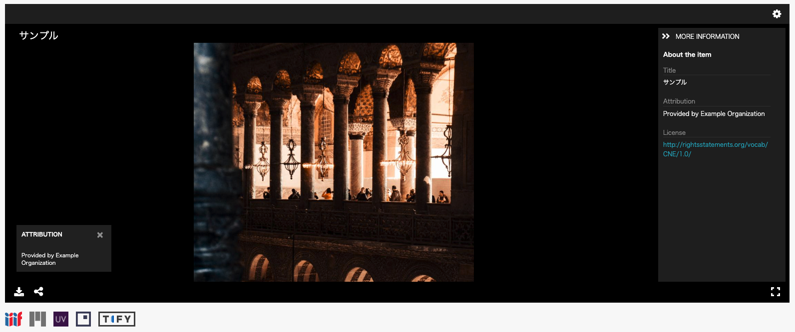
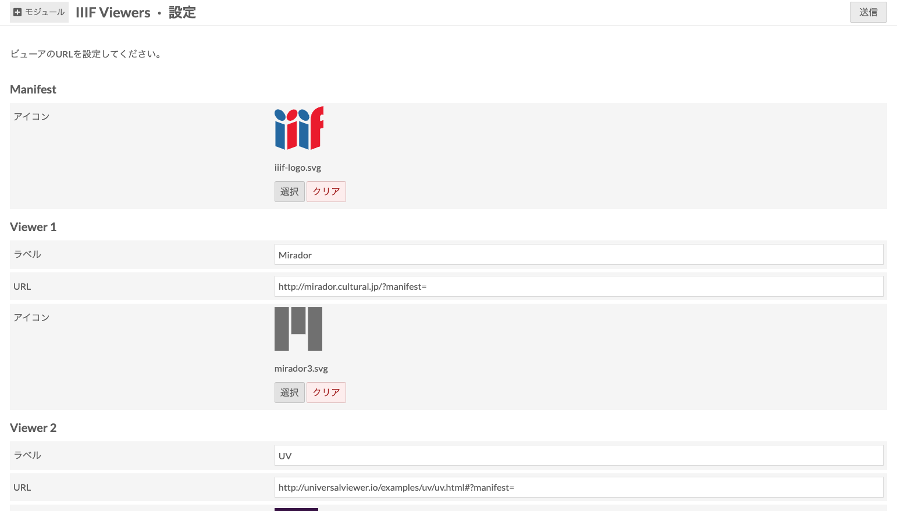

# IIIF Viewers (module for Omeka S)

# [](https://travis-ci.com/utda/Omeka-S-module-IiifViewers)

[IIIF Viewers] is a module to show IIIF Manifest URI icon and viewers.





## Installation

See general end user documentation for [installing a module].

### From the zip

Download the last release [IIIFViewers.zip] from the list of releases, and
uncompress it in the `modules` directory.

### From the source and for development

If the module was installed from the source, rename the name of the folder of
the module to `IIIFViewers`, go to the root of the module, and run:

```sh
composer install --no-dev
```

### Compilation of Universal Viewer

The Universal Viewer is provided as a compressed file in order to be installed quickly with composer. The compressed file is the vanilla version that is built with default options.

So, you need to compile Universal Viewer only for development.

For v4, in a temp directory:

```
cd /tmp
git clone https://github.com/UniversalViewer/universalviewer
cd universalviewer
npm install
npm run build
```

Then, the content of the directory "dist" is copied in the directory "asset/vendor/uv" of the module.

### Update Mirador

Download the latest version of Mirador and copy it to the module directory.

```
cd ./asset/vendor/mirador
wget -O mirador.min.js https://unpkg.com/mirador@latest/dist/mirador.min.js
```

## Warning

Use it at your own risk.

It’s always recommended to backup your files and your databases and to check
your archives regularly so you can roll back if needed.

## Troubleshooting

See online issues on the [module issues] page on GitHub.

## Contributors

- Satoru Nakamura, 2021- (see [nakamura196] on GitHub)
- National Institute of Japanese Literature, 2021- (see [nijl])

[IIIF Viewers]: https://github.com/omeka-j/Omeka-S-module-IIIFViewers
[Omeka S]: https://omeka.org/s
[installing a module]: http://dev.omeka.org/docs/s/user-manual/modules/#installing-modules
[IIIFViewers.zip]: https://github.com/omeka-j/Omeka-S-module-IIIFViewers/releases
[module issues]: https://github.com/omeka-j/Omeka-S-module-IIIFViewers/issues
[nakamura196]: https://github.com/nakamura196 "Satoru Nakamura"
[nijl]: https://www.nijl.ac.jp/en/ "National Institute of Japanese Literature"

#

```

```
